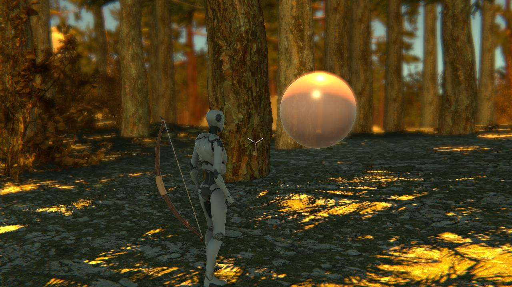

# MTEC2120-First_Project
## Homework 1
### Built terrain and imported starter assets 

## Homework 2 
### Added a bow that aims towards the center of the screen and shoots arrows on left mouse click

https://github.com/sendemina/MTEC2120-First_Project/assets/89432530/a09dadfc-c7b4-4722-b1af-823ac887728b

## Homework 3
### Added a balloon that floats and gets popped on collision

## Homework 4 - separate repo

## Homework 5
### Added a custom action: the bow is now controlled by the input system

## Homework 6
### Added custom animations to the character 
### *- shooting an arrow on left click
### *- kicking on right click

https://github.com/sendemina/MTEC2120-First_Project/assets/89432530/980f5229-d804-4741-8bc2-64f0b1e35318

